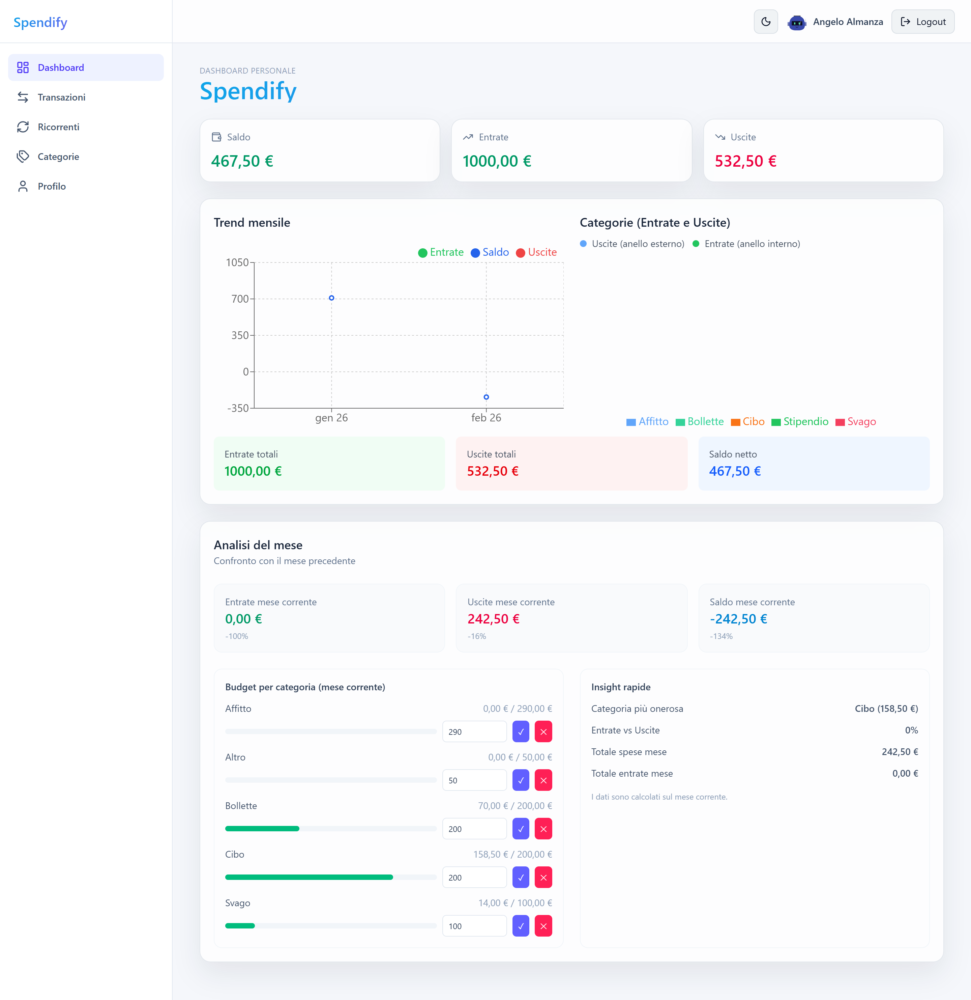
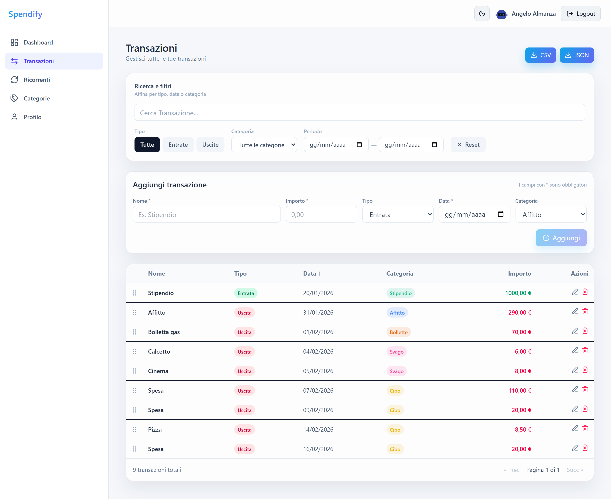
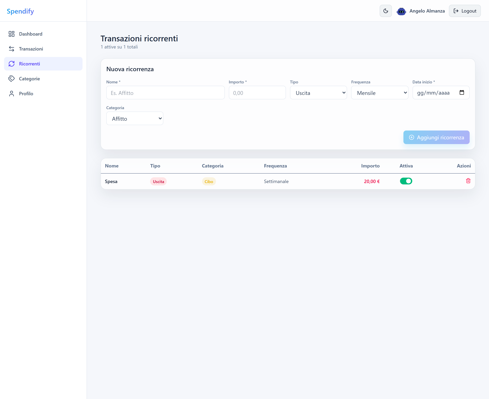
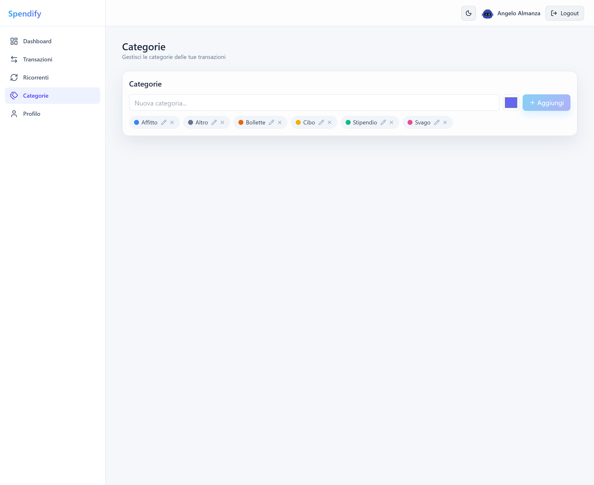
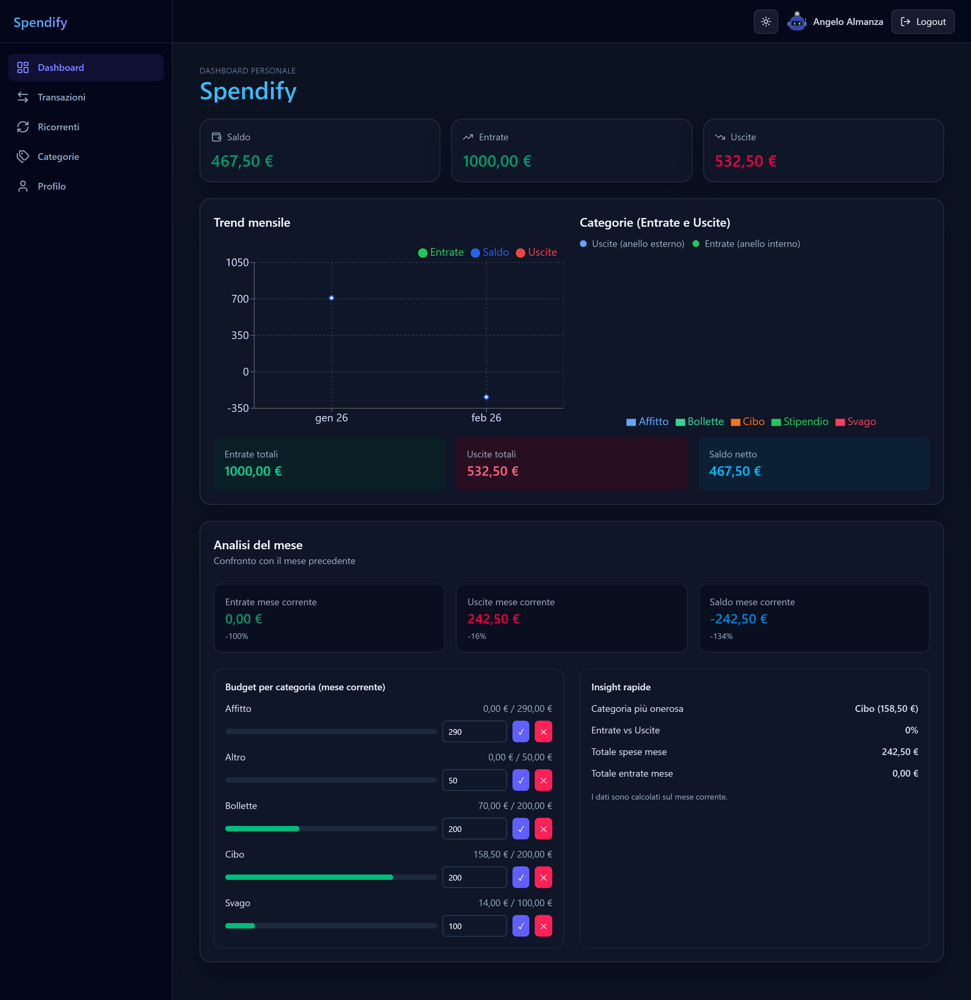

# Spendify

Web app fullstack per la gestione di entrate e uscite personali. Dashboard con grafici interattivi, budget per categoria, transazioni ricorrenti, dark mode e navigazione a pagine con sidebar.

## Demo

Live: [spendify-app.netlify.app](https://spendify-app.netlify.app/)

## Screenshot

### Login


### Dashboard



### Transazioni



### Ricorrenti



### Categorie



### Dark mode



## Funzionalità

- Autenticazione con email + password e **Google OAuth**
- **Reset password** via email (Resend)
- Navigazione a pagine con **sidebar** responsive
- Dashboard con KPI, trend mensili e breakdown per categoria
- Grafici interattivi (barre entrate/uscite, donut per categoria)
- **Categorie personalizzate** con colore a scelta e modifica inline
- **Budget per categoria** con avviso quando viene superato
- **Transazioni ricorrenti** (settimanali/mensili) con generazione automatica e catch-up
- Ricerca, filtri combinabili (tipo, data, categoria) e ordinamento colonne
- Aggiunta, modifica inline ed eliminazione transazioni
- Export CSV e JSON
- Paginazione tabella transazioni
- Profilo utente con selezione avatar
- **AI categorizzazione** — suggerimento automatico della categoria basato sul nome della transazione
- **AI insight mensili** — analisi in linguaggio naturale delle spese in dashboard
- **Dark / Light mode** con preferenza salvata

## Tech Stack

### Frontend
- React 19 + Vite
- Tailwind CSS v4
- React Router (navigazione a pagine)
- Recharts (grafici)
- Lucide Icons
- Axios

### Backend
- Laravel 11
- Laravel Sanctum (autenticazione token)
- Laravel Socialite (Google OAuth)
- Resend (email transazionali)
- PostgreSQL
- PHP Enums + Form Requests + Service layer

### AI
- Groq API (Llama 3.1 8B per categorizzazione, Llama 3.3 70B per insight)
- Interfaccia astratta (`AiProvider`) per cambio provider futuro
- Cache server-side 6h sugli insight
- Fallback silenzioso se il servizio AI non è disponibile

### Infrastructure
- Docker + Docker Compose (sviluppo locale)
- Netlify (frontend)
- Render (backend)
- Neon (database PostgreSQL)
- cron-job.org (scheduler ricorrenze)

## Avvio locale

```bash
docker compose up --build
```

App disponibile su [http://localhost:5173](http://localhost:5173)

## Struttura del progetto

```
spendify/
├── docker-compose.yml
├── frontend/                   # React + Vite
│   ├── src/
│   │   ├── api/                # Axios client
│   │   ├── context/            # AuthContext, ThemeContext
│   │   ├── hook/               # Custom hooks (auth, transactions, categories, recurring)
│   │   ├── layouts/            # AppLayout, Sidebar
│   │   ├── lib/                # Utility (format, export, styles)
│   │   ├── pages/              # Dashboard, Transactions, Recurring, Categories, Profile
│   │   └── components/         # UI components
│   └── ...
└── backend/                    # Laravel 11
    ├── app/
    │   ├── Console/Commands/   # recurring:process
    │   ├── Enums/              # TransactionType, Frequency
    │   ├── Http/
    │   │   ├── Controllers/
    │   │   └── Requests/       # Form Request (validazione)
    │   ├── Contracts/           # AiProvider interface
    │   ├── Models/
    │   └── Services/           # RecurringTransactionService, GroqAiProvider, AiInsightsService
    ├── database/migrations/
    └── routes/api.php
```

## Architettura backend

**Enums** — I valori `income`/`expense` e `weekly`/`monthly` sono PHP backed enums castati nei model Eloquent. Elimina le magic strings e centralizza i valori validi.

**Form Requests** — La validazione è estratta dai controller in classi dedicate (`app/Http/Requests/`). I campi tipizzati usano `Enum` rule. I controller ricevono dati già validati tramite `$request->validated()`.

**Service Layer** — La logica di generazione transazioni da template ricorrenti è in `RecurringTransactionService`, usata sia dal controller che dal cron job.

**AI Provider** — L'integrazione AI è dietro l'interfaccia `AiProvider` (`app/Contracts/`), con implementazione concreta `GroqAiProvider`. Il binding è nel `AppServiceProvider` come singleton. `AiInsightsService` gestisce l'assemblaggio dei dati finanziari e la cache. L'intero layer AI è progettato per fallire silenziosamente: se Groq è down o la API key manca, il frontend mostra i dati statici senza errori visibili.
